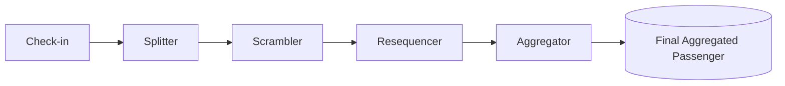

# ✈️ Bluff City Airport – Enterprise System Integration Simulation

This project simulates the messaging flow of a fictional airport called **Bluff City Airport**.  

The goal is to demonstrate **system integration concepts** and **Enterprise Integration Patterns (EIP)** using **RabbitMQ**, **C#**, and **Go**.

## 🎯 Project Goal
Airports rely on many subsystems working together. Here we focus on **passenger check-in and luggage handling**, showing how data flows through different messaging steps:

1. **Check-in** – create a passenger record with flight and luggage information.  
2. **Splitter** – split passenger and luggage info into separate messages for further external handling.  
3. **Scrambler** – shuffle/delay messages to simulate real-world systems.  
4. **Resequencer** – restore the correct order.  
5. **Aggregator** – merge data back into a full passenger record.

## 🔄 Data Flow

## 🛠 Technologies

* RabbitMQ (via Docker Compose)
* C# (.NET) - for the majority of messaging
* Go - used for logging and the scrambling simulation

## 🚀 Getting Started

1. Start RabbitMQ:

   ```bash
   docker compose up -d
   ```

   * UI: [http://localhost:15672](http://localhost:15672) (guest/guest)

2. Run the services step by step to see the message flow in detailed output logs.

---

This project was built for **educational purposes**, simulating how enterprise messaging patterns can be applied in an airport scenario.

