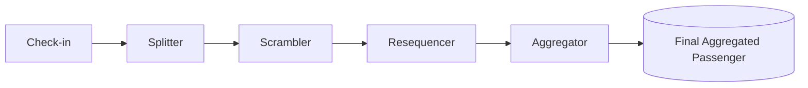

# ✈️ Bluff City Airport – Enterprise System Integration Simulation

This project simulates the messaging flow of a fictional airport called **Bluff City Airport**.
The goal is to demonstrate **system integration concepts** and **Enterprise Integration Patterns (EIP)** using **RabbitMQ**, **C#**, and **Go**.

---

## 🎯 Project Goal

Airports rely on many subsystems working together. Here we focus on **passenger check-in and luggage handling**, showing how data flows through different messaging steps:

1. **Check-in** – create a check-in record with flight, passenger and luggage information.
2. **Splitter** – split flight, passenger and luggage info into separate messages for further external handling.
3. **Scrambler** – shuffle/delay the luggage messages to simulate real-world systems.
4. **Resequencer** – restore the correct order of luggage messages.
5. **Aggregator** – merge data back into a full check-in record.

Additionally, we built an external logging system that delivers detailed, real-time insights into how data and messages flow through the system.

---

## 🔄 Data Flow



---

## 🛠 Technologies

* RabbitMQ (via Docker Compose)
* C# (.NET) — majority of messaging components
* Go — logging and scrambling simulation

---

## 🚀 Getting Started

> **Important prerequisites**
>
> * You must have Docker + Docker Compose installed.
> * .NET SDK (for `dotnet run`) and Go toolchain (for `go run`) installed.
> * Run all commands **from the project root folder**.

### 1) Start RabbitMQ (Docker)

```bash
docker compose up -d
```

* Management UI: [http://localhost:15672](http://localhost:15672)  — login: `guest` / `guest`

### 2) Start the log collector

From the project root:

```bash
go run go-log-collector.go
```

This process prints detailed, human-readable logs about everything happening in the system.

### 3) Start the main messaging system

From the project root:

```bash
dotnet run --project Airport
```

This runs the main messaging system — it will send messages through RabbitMQ and drive the simulated flow.

⚠️ **Note:** `dotnet run --project Airport` **does not produce console output** on its own. Use the Go log collector to see what’s happening.

---

This project was built for **educational purposes**, simulating how enterprise messaging patterns can be applied in an airport scenario.
